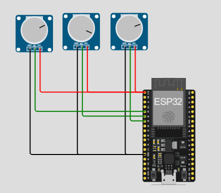
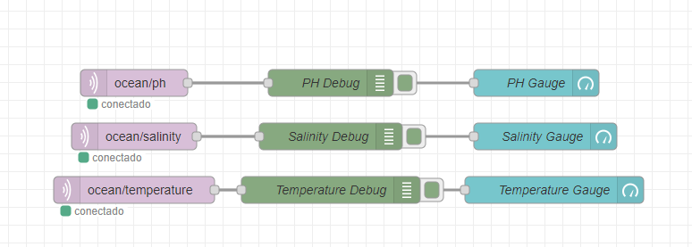
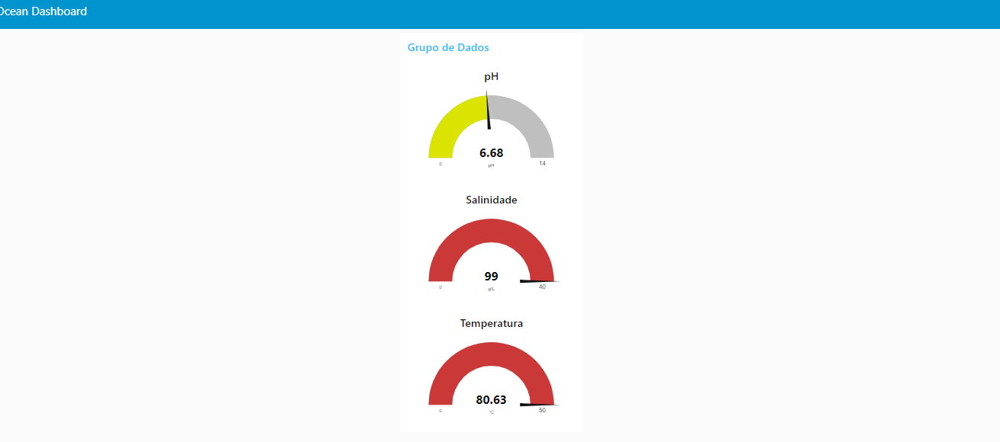

<div align="center">
  <h1>EcoWave</h1>
</div>
<hr/>

## Descrição

Este projeto consiste em um simulador utilizando o ESP32 para medir o pH, a salinidade e a temperatura da água. Os dados são enviados via MQTT para o Node-RED e exibidos em um dashboard.

## Componentes Utilizados

- ESP32
- Potenciômetros (3) para simular sensores de pH, salinidade e temperatura
- Node-RED
- Biblioteca PubSubClient para Arduino
- Conexão Wi-Fi
- Broker MQTT (utilizamos o broker público do HiveMQ)

## Plataformas Utilizadas

[Wokwi:] Para simulação do Arduino e seus componentes.
[TagoIO:] Para conexão, envio e visualização dos dados em dashboards.


## Código Arduino

Instruções de Uso

### Passo 1: Configurar o ESP32

1. **Código do ESP32**: Utilize o código abaixo para programar seu ESP32. 
```cpp
#include <WiFi.h>
#include <PubSubClient.h>

// Configurações da rede Wi-Fi
const char* ssid = "SWokwi-GUEST";
const char* password = "";

// Configurações do servidor MQTT (HiveMQ Broker público)
const char* mqtt_server = "broker.hivemq.com";
const int mqtt_port = 1883;

// Definição dos pinos dos sensores
const int phPin = 34;
const int salinityPin = 35;
const int tempPin = 32;

WiFiClient espClient;
PubSubClient client(espClient);

void setup_wifi() {
  delay(10);
  Serial.begin(115200);
  Serial.println();
  Serial.print("Conectando a ");
  Serial.println(ssid);

  WiFi.begin(ssid, password);

  while (WiFi.status() != WL_CONNECTED) {
    delay(500);
    Serial.print(".");
  }

  Serial.println("");
  Serial.println("WiFi conectado");
  Serial.println("Endereço IP: ");
  Serial.println(WiFi.localIP());
}

void reconnect() {
  while (!client.connected()) {
    Serial.print("Tentando conectar ao MQTT...");
    if (client.connect("ESP32Client")) {
      Serial.println("conectado");
    } else {
      Serial.print("falha, rc=");
      Serial.print(client.state());
      Serial.println(" tentando novamente em 5 segundos");
      delay(5000);
    }
  }
}

// Função para ler os valores dos sensores
float readPH() {
  int phValue = analogRead(phPin);
  float voltage = phValue * (3.3 / 4095.0);
  float ph = 3.5 * voltage + 3.0; // Equação de calibração fictícia
  return ph;
}

float readSalinity() {
  int salinityValue = analogRead(salinityPin);
  float voltage = salinityValue * (3.3 / 4095.0);
  float salinity = 30 * voltage; // Equação de calibração fictícia
  return salinity;
}

float readTemperature() {
  int tempValue = analogRead(tempPin);
  float voltage = tempValue * (3.3 / 4095.0);
  float temperature = (voltage - 0.5) * 100.0; // Equação de calibração fictícia
  return temperature;
}

void setup() {
  Serial.begin(115200);
  setup_wifi();
  client.setServer(mqtt_server, mqtt_port);
}

void loop() {
  if (!client.connected()) {
    reconnect();
  }
  client.loop();

  float ph = readPH();
  float salinity = readSalinity();
  float temperature = readTemperature();

  char phString[8];
  dtostrf(ph, 1, 2, phString);
  client.publish("ocean/ph", phString);

  char salinityString[8];
  dtostrf(salinity, 1, 2, salinityString);
  client.publish("ocean/salinity", salinityString);

  char temperatureString[8];
  dtostrf(temperature, 1, 2, temperatureString);
  client.publish("ocean/temperature", temperatureString);

  delay(300); // Enviar dados a cada 0,3 segundos
}

##  Fluxo dos Dados 

Os dados são enviados do Wokwi para o Node-RED, que os processa e encaminha para o TagoIO.





Os dados são visualizados em dashboards no TagoIO para monitoramento em tempo real.



## Conclusão

Com esses passos, você terá um simulador que mede o pH, a salinidade e a temperatura da água e envia esses dados para o Node-RED, onde podem ser visualizados em um dashboard.

## :smile: Integrantes
- [Maria Julia Araujo Rodrigues - RM553384](https://github.com/majuaraujo)

###### Clique no nome para visitar o GitHub
